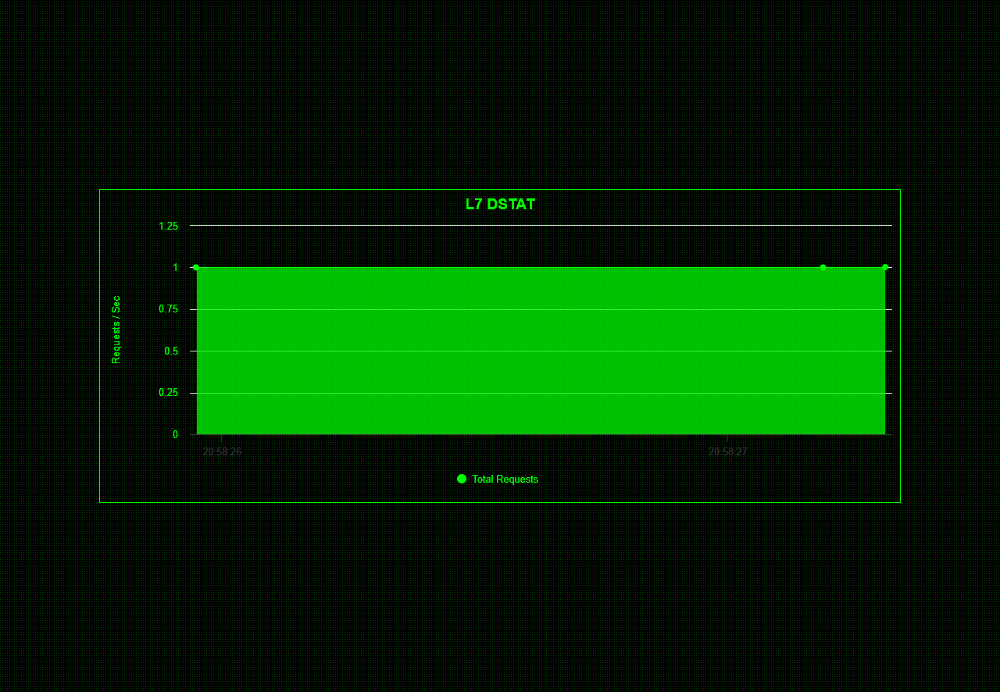

# Yakuza-Dstat
A basic Layer 7 Dstat using charts.js and Nginx Status page.

### Nginx status page

```
server {
  listen 80;

  # The host name to respond to
  server_name myhostname.com;

  location / {
    root      /var/www/html/dstat;
    index     index.html;
  }

  location /nginx_status {
    # Turn on stats
    stub_status on;
    access_log off;
  }
}
```


### Preview

<p align="center">
    
</p>

Live Demo: [Dstat](https://dstat.xn--45qx7by8s.online/)
